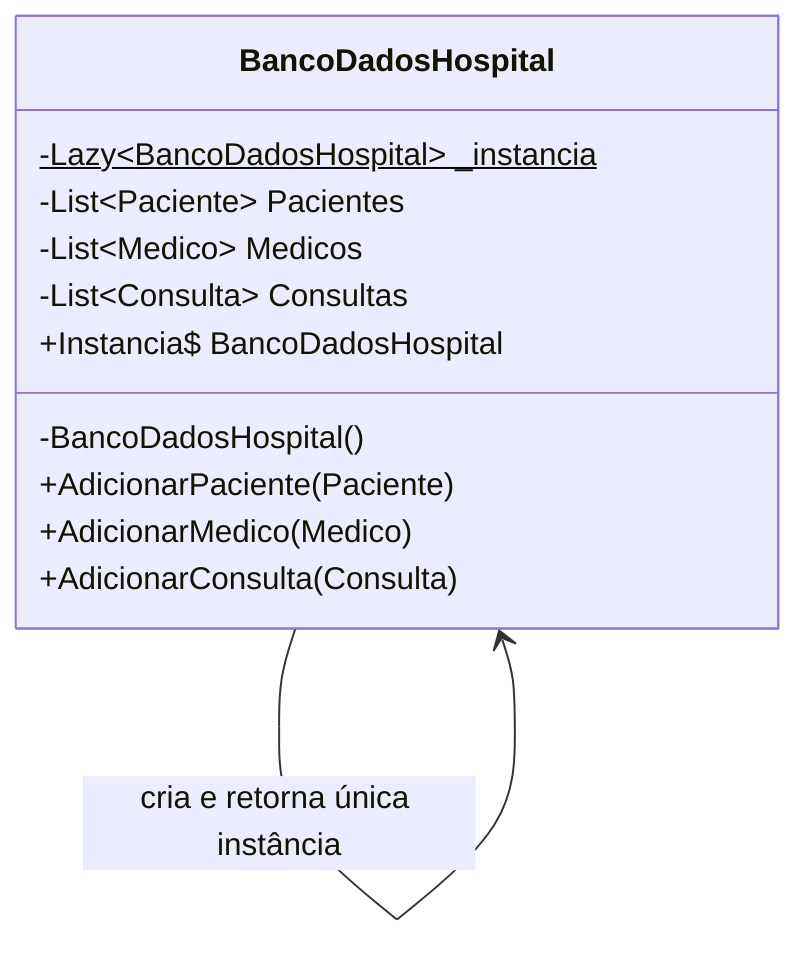
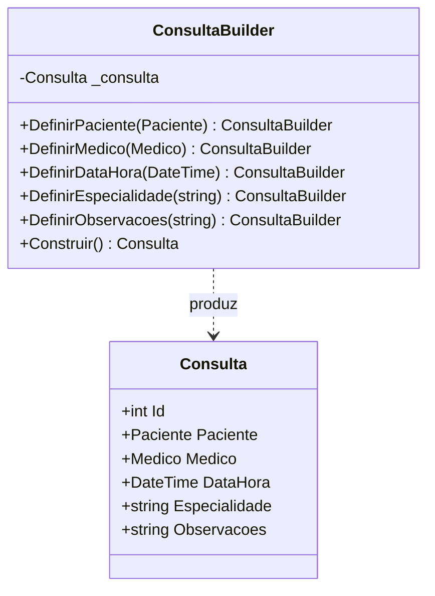
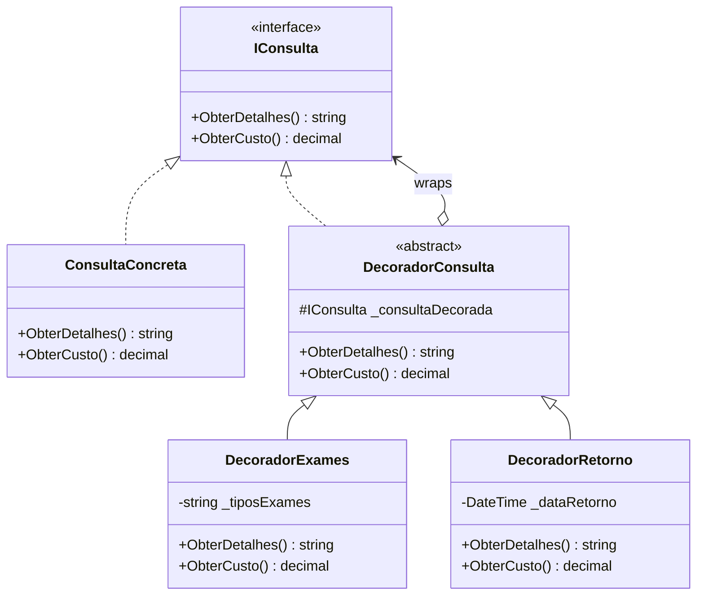
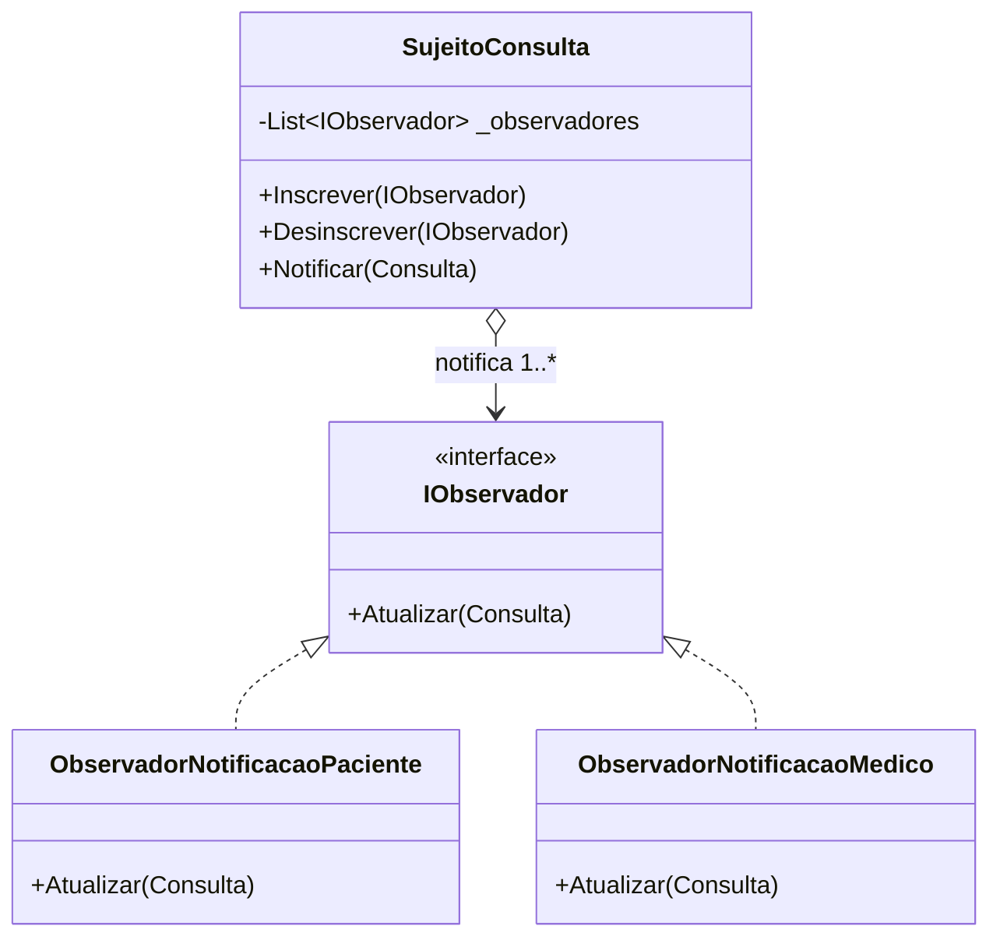

# Design Patterns — HospitalApp

> Documento de referência dos quatro padrões de projeto implementados no sistema hospitalar em C# / .NET 8.

---

## 1. Singleton (Criacional)

### Conceito
Garante que uma classe possua **apenas uma instância** durante toda a vida da aplicação, fornecendo um ponto de acesso global a ela. Resolve o problema de recursos compartilhados que não devem ser duplicados.

### Aplicabilidade
- Gerenciadores de configuração ou conexão com banco de dados  
- Logs centralizados  
- Caches globais compartilhados entre módulos  

### Justificativa no Projeto
`BancoDadosHospital` representa o repositório central em memória. Se houvesse múltiplas instâncias, cada módulo trabalharia com listas diferentes, causando inconsistência nos dados de pacientes, médicos e consultas. O Singleton garante que todos os módulos compartilhem **o mesmo estado**.

A implementação usa `Lazy<T>` que é thread-safe por padrão, eliminando a necessidade de bloqueios (`lock`) manuais.

### Diagrama

---

## 2. Builder (Criacional)

### Conceito
Separa a **construção** de um objeto complexo da sua **representação**, permitindo criar diferentes versões do objeto usando o mesmo processo de construção. Normalmente usa uma API fluente com encadeamento de métodos.

### Aplicabilidade
- Objetos com muitos parâmetros opcionais (evita construtores "telescópicos")  
- Quando a ordem de configuração importa  
- Quando é necessário validar o objeto antes de entregá-lo ao chamador  

### Justificativa no Projeto
`Consulta` possui vários atributos (paciente, médico, data, especialidade, observações). Um único construtor com todos os parâmetros seria difícil de usar e propenso a erros. O `ConsultaBuilder` oferece uma API legível e valida a completude antes de executar `Construir()`.

### Diagrama

---

## 3. Decorator (Estrutural)

### Conceito
Anexa **responsabilidades adicionais** a um objeto de forma dinâmica, sem alterar sua classe. Os decoradores são uma alternativa flexível à herança para estender funcionalidades (respeita o princípio Open/Closed do SOLID).

### Aplicabilidade
- Quando a herança levaria a uma explosão de subclasses para cada combinação de funcionalidades  
- Quando é necessário adicionar/remover funcionalidades em tempo de execução  
- Extensão de componentes de terceiros sem acesso ao código-fonte  

### Justificativa no Projeto
Uma consulta pode ter exames, retorno, ou ambos. Criar subclasses para cada combinação (`ConsultaComExames`, `ConsultaComRetorno`, `ConsultaComExamesERetorno`) seria inviável. Os decoradores se encadeiam dinamicamente: `ConsultaConcreta → DecoradorExames → DecoradorRetorno`, somando detalhes e custos sem modificar nenhuma classe existente.

### Diagrama

---

## 4. Observer (Comportamental)

### Conceito
Define uma dependência **um-para-muitos** entre objetos: quando o sujeito muda de estado, todos os dependentes (observadores) são notificados e atualizados automaticamente. Promove desacoplamento entre produtor e consumidor de eventos.

### Aplicabilidade
- Sistemas de eventos e notificações  
- Interfaces que devem refletir mudanças em modelos (MVC)  
- Comunicação entre componentes sem referências diretas  

### Justificativa no Projeto
Quando uma consulta é criada, múltiplos interessados devem ser notificados (paciente por SMS, médico na agenda, futuramente: faturamento, laboratório). O `SujeitoConsulta` não conhece os detalhes de cada observador — apenas chama `Atualizar()`. Novos observadores podem ser adicionados sem alterar nada no sujeito.

### Diagrama

